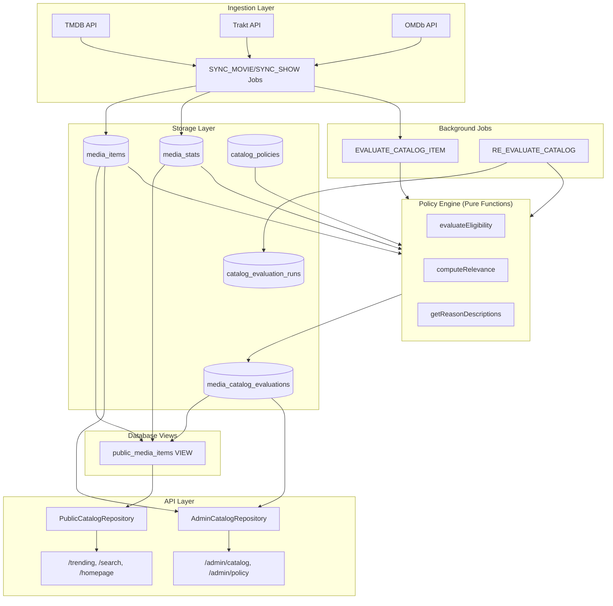
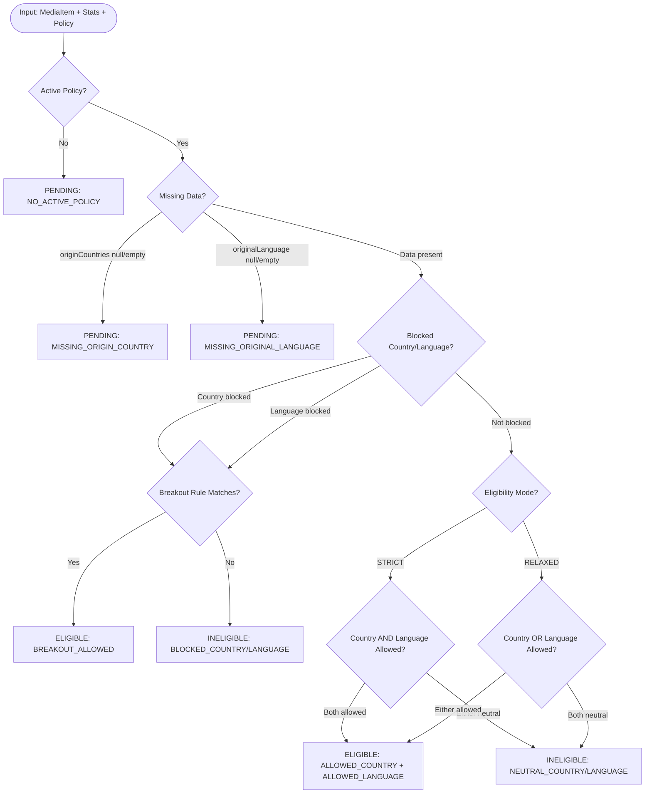
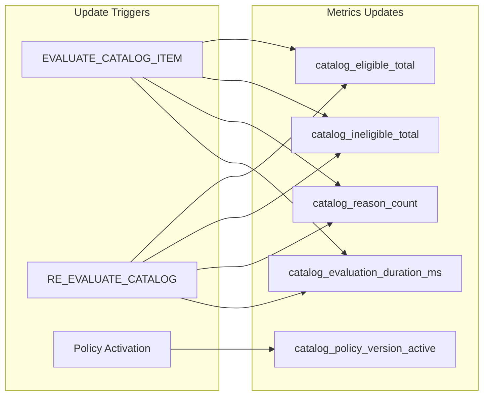

# Design Document: Catalog Policy Engine

## Overview

Catalog Policy Engine — модуль для керування публічним каталогом медіа-контенту з версіонованими політиками та детермінованим прийняттям рішень. Система додає evaluation layer поверх існуючої моделі `media_items`, забезпечуючи прозорі правила фільтрації.

Ключові принципи:
- `media_items` залишається "warehouse" (всі дані з джерел)
- `media_catalog_evaluations` — окремий шар з результатами політики
- `public_media_items` view — єдина точка доступу для публічних endpoints
- Policy Engine — pure functions для детермінованих рішень

## Architecture



## Components and Interfaces

### 1. Database Schema Extensions

#### media_items (розширення)
```typescript
// Нові поля в існуючій таблиці
originCountries: jsonb // string[] - ISO 3166-1 alpha-2 codes
originalLanguage: text // ISO 639-1 code
```

#### media_catalog_evaluations (нова таблиця)
```typescript
interface MediaCatalogEvaluation {
  mediaItemId: UUID;           // PK, FK to media_items
  status: EligibilityStatus;   // PENDING | ELIGIBLE | INELIGIBLE | REVIEW
  reasons: string[];           // Evaluation reason keys
  relevanceScore: number;      // 0-100
  policyVersion: number;       // Version of policy used
  breakoutRuleId: string | null; // ID of matched breakout rule
  evaluatedAt: Date;
}
```

#### catalog_policies (нова таблиця)
```typescript
interface CatalogPolicy {
  id: UUID;
  version: number;
  isActive: boolean;
  policy: PolicyConfig;
  createdAt: Date;
  activatedAt: Date | null;
}

interface PolicyConfig {
  allowedCountries: string[];
  blockedCountries: string[];
  blockedCountryMode: 'ANY' | 'MAJORITY';
  allowedLanguages: string[];
  blockedLanguages: string[];
  globalProviders: string[];
  breakoutRules: BreakoutRule[];
  // Eligibility mode: STRICT = country AND language must be allowed
  //                   RELAXED = country OR language allowed (not recommended)
  eligibilityMode: 'STRICT' | 'RELAXED';
  homepage: {
    minRelevanceScore: number;
  };
}

interface BreakoutRule {
  id: string;
  name: string;
  priority: number;
  requirements: {
    minImdbVotes?: number;
    minTraktVotes?: number;
    minQualityScoreNormalized?: number; // 0-1 scale
    requireAnyOfProviders?: string[];
    requireAnyOfRatingsPresent?: ('imdb' | 'metacritic' | 'rt' | 'trakt')[];
  };
}
```

#### catalog_evaluation_runs (нова таблиця)
```typescript
interface CatalogEvaluationRun {
  id: UUID;
  policyVersion: number;
  status: 'PENDING' | 'RUNNING' | 'COMPLETED' | 'FAILED';
  startedAt: Date;
  finishedAt: Date | null;
  cursor: string | null;        // For resumability
  counters: {
    processed: number;
    eligible: number;
    ineligible: number;
    review: number;
    reasonBreakdown: Record<string, number>;
  };
}
```

### 2. Policy Engine Module

```typescript
// apps/api/src/modules/catalog-policy/domain/policy-engine.ts

export type EligibilityStatus = 'PENDING' | 'ELIGIBLE' | 'INELIGIBLE' | 'REVIEW';

export interface Evaluation {
  status: EligibilityStatus;
  reasons: EvaluationReason[];
  breakoutRuleId: string | null;
}

export type EvaluationReason =
  | 'MISSING_ORIGIN_COUNTRY'
  | 'MISSING_ORIGINAL_LANGUAGE'
  | 'BLOCKED_COUNTRY'
  | 'BLOCKED_LANGUAGE'
  | 'NEUTRAL_COUNTRY'
  | 'NEUTRAL_LANGUAGE'
  | 'MISSING_GLOBAL_SIGNALS'
  | 'BREAKOUT_ALLOWED'
  | 'ALLOWED_COUNTRY'
  | 'ALLOWED_LANGUAGE'
  | 'NO_ACTIVE_POLICY';  // When no policy is active (fallback only, should not occur after seed)

export interface PolicyEngineInput {
  mediaItem: {
    id: string;
    originCountries: string[] | null;
    originalLanguage: string | null;
    watchProviders: WatchProvidersMap | null;
    voteCountImdb: number | null;
    voteCountTrakt: number | null;
    ratingImdb: number | null;
    ratingMetacritic: number | null;
    ratingRottenTomatoes: number | null;
    ratingTrakt: number | null;
  };
  stats: {
    qualityScore: number | null;
    popularityScore: number | null;
    freshnessScore: number | null;
    ratingoScore: number | null;
  } | null;
}

/**
 * Pure function: evaluates media eligibility based on policy rules.
 * Order of checks:
 * 1. Missing data checks (originCountries, originalLanguage) → PENDING (not INELIGIBLE)
 * 2. Blocked checks (country, language)
 * 3. Breakout checks (by priority)
 * 4. Neutral checks (not in allowed/blocked)
 * 5. Allowed checks (whitelist)
 * 
 * Design Decision: Missing metadata returns PENDING (not INELIGIBLE) because:
 * - Data may be populated later via subsequent syncs
 * - INELIGIBLE implies "consciously blocked by policy"
 * - PENDING allows admin to see "needs data" vs "blocked"
 */
export function evaluateEligibility(
  input: PolicyEngineInput,
  policy: PolicyConfig
): Evaluation;

/**
 * Pure function: computes relevance score (0-100) for homepage ranking.
 */
export function computeRelevance(
  input: PolicyEngineInput,
  policy: PolicyConfig
): number;

/**
 * Returns human-readable descriptions for evaluation reasons.
 */
export function getReasonDescriptions(
  reasons: EvaluationReason[],
  locale: string
): Record<EvaluationReason, string>;
```

### 3. Repository Interfaces

```typescript
// PublicCatalogRepository - reads only from public_media_items view
export interface IPublicCatalogRepository {
  findTrending(options: PaginationOptions): Promise<PublicMediaItemRow[]>;
  search(query: string, options: PaginationOptions): Promise<PublicMediaItemRow[]>;
  findForHomepage(minRelevanceScore: number): Promise<PublicMediaItemRow[]>;
  findById(id: string): Promise<PublicMediaItemRow | null>;
}

// AdminCatalogRepository - full access to media_items + evaluations
export interface IAdminCatalogRepository {
  findAll(options: AdminQueryOptions): Promise<MediaItemWithEvaluation[]>;
  findById(id: string): Promise<MediaItemWithEvaluation | null>;
  findByEligibilityStatus(status: EligibilityStatus): Promise<MediaItemWithEvaluation[]>;
}

// PublicMediaItemRow - DTO for public view
export interface PublicMediaItemRow {
  id: string;
  type: 'movie' | 'show';
  tmdbId: number;
  title: string;
  slug: string;
  overview: string | null;
  posterPath: string | null;
  backdropPath: string | null;
  rating: number;
  trendingScore: number;
  relevanceScore: number;
  // ... other public fields
}
```

### 4. Job Handlers

```typescript
// EVALUATE_CATALOG_ITEM job
interface EvaluateCatalogItemPayload {
  mediaItemId: string;
}

// RE_EVALUATE_CATALOG job
interface ReEvaluateCatalogPayload {
  policyVersion: number;
  batchSize?: number;  // default: 1000
  cursor?: string;     // for resumability
}
```

### 5. Dry-Run Service

```typescript
// apps/api/src/modules/catalog-policy/application/services/dry-run.service.ts

export type DryRunMode = 'sample' | 'top' | 'byType' | 'byCountry';

export interface DryRunOptions {
  mode: DryRunMode;
  limit?: number;           // max 10000, default 1000
  mediaType?: 'movie' | 'show';  // for byType mode
  country?: string;         // for byCountry mode (ISO 3166-1 alpha-2)
  diffMode?: boolean;       // compare against current active policy
}

export interface DryRunSummary {
  totalEvaluated: number;
  newlyEligible: number;
  newlyIneligible: number;
  unchanged: number;
  reasonBreakdown: Record<EvaluationReason, number>;
  // Only present when diffMode=true
  diff?: {
    currentPolicyVersion: number;
    proposedPolicyVersion: number;
    statusChanges: Array<{
      mediaItemId: string;
      title: string;
      oldStatus: EligibilityStatus;
      newStatus: EligibilityStatus;
      oldReasons: EvaluationReason[];
      newReasons: EvaluationReason[];
    }>;
  };
  executionTimeMs: number;
}

export interface IDryRunService {
  /**
   * Execute dry-run evaluation with proposed policy.
   * Does NOT modify media_catalog_evaluations table.
   * Enforces limits: max 10000 items, 60s timeout.
   */
  execute(
    proposedPolicy: PolicyConfig,
    options: DryRunOptions
  ): Promise<DryRunSummary>;
}
```

### 6. Observability Components

```typescript
// apps/api/src/modules/catalog-policy/infrastructure/metrics/catalog-metrics.ts

export interface ICatalogMetrics {
  // Gauge: current count of eligible items
  setEligibleTotal(count: number): void;
  
  // Gauge: current count of ineligible items
  setIneligibleTotal(count: number): void;
  
  // Gauge: current count of pending items
  setPendingTotal(count: number): void;
  
  // Gauge: current count of items with each reason (state snapshot)
  setReasonTotal(reason: EvaluationReason, count: number): void;
  
  // Counter: increment reason emitted count (event stream)
  incrementReasonEmitted(reason: EvaluationReason): void;
  
  // Gauge: current active policy version
  setActivePolicyVersion(version: number): void;
  
  // Histogram: evaluation job duration
  recordEvaluationDuration(durationMs: number): void;
}

// apps/api/src/modules/catalog-policy/infrastructure/audit/catalog-audit-logger.ts

export interface EligibilityChangeEvent {
  mediaItemId: string;
  oldStatus: EligibilityStatus | null;  // null for new items
  newStatus: EligibilityStatus;
  oldReasons: EvaluationReason[];
  newReasons: EvaluationReason[];
  policyVersion: number;
  timestamp: Date;
}

export interface ReEvaluationEvent {
  mediaItemId: string;
  policyVersion: number;
  statusUnchanged: boolean;
  timestamp: Date;
}

export interface ICatalogAuditLogger {
  logEligibilityChange(event: EligibilityChangeEvent): void;
  logReEvaluation(event: ReEvaluationEvent): void;
}
```

## Data Models

### Drizzle Schema

```typescript
// apps/api/src/database/schema.ts

// New enum
export const eligibilityStatusEnum = pgEnum('eligibility_status', [
  'pending',
  'eligible', 
  'ineligible',
  'review'
]);

export const evaluationRunStatusEnum = pgEnum('evaluation_run_status', [
  'pending',
  'running',
  'completed',
  'failed'
]);

// Extend media_items
// ALTER TABLE media_items ADD COLUMN origin_countries jsonb;
// ALTER TABLE media_items ADD COLUMN original_language text;

// New table: catalog_policies
export const catalogPolicies = pgTable('catalog_policies', {
  id: uuid('id').defaultRandom().primaryKey(),
  version: integer('version').notNull(),
  isActive: boolean('is_active').default(false).notNull(),
  policy: jsonb('policy').$type<PolicyConfig>().notNull(),
  createdAt: timestamp('created_at').defaultNow().notNull(),
  activatedAt: timestamp('activated_at'),
}, (t) => ({
  // Partial unique index on constant (1) where active - ensures only one active
  // SQL: CREATE UNIQUE INDEX catalog_policies_single_active ON catalog_policies ((1)) WHERE is_active = true;
  versionIdx: index('catalog_policies_version_idx').on(t.version),
}));
// Note: partial unique index created via raw SQL migration

// New table: media_catalog_evaluations
export const mediaCatalogEvaluations = pgTable('media_catalog_evaluations', {
  mediaItemId: uuid('media_item_id')
    .references(() => mediaItems.id, { onDelete: 'cascade' })
    .primaryKey(),
  status: eligibilityStatusEnum('status').default('pending').notNull(),
  reasons: text('reasons').array().default([]).notNull(),
  relevanceScore: integer('relevance_score').default(0).notNull(),
  policyVersion: integer('policy_version').default(0).notNull(), // 0 = no policy / pending seed
  breakoutRuleId: text('breakout_rule_id'),
  evaluatedAt: timestamp('evaluated_at'), // NULL for pending, set when actually evaluated
}, (t) => ({
  statusIdx: index('media_catalog_eval_status_idx').on(t.status),
  statusRelevanceIdx: index('media_catalog_eval_status_relevance_idx')
    .on(t.status, t.relevanceScore),
  policyVersionIdx: index('media_catalog_eval_policy_version_idx').on(t.policyVersion),
  // CHECK constraint added via migration
}));

// New table: catalog_evaluation_runs
export const catalogEvaluationRuns = pgTable('catalog_evaluation_runs', {
  id: uuid('id').defaultRandom().primaryKey(),
  policyVersion: integer('policy_version').notNull(),
  status: evaluationRunStatusEnum('status').default('pending').notNull(),
  startedAt: timestamp('started_at').defaultNow().notNull(),
  finishedAt: timestamp('finished_at'),
  cursor: text('cursor'),
  counters: jsonb('counters').$type<{
    processed: number;
    eligible: number;
    ineligible: number;
    review: number;
    reasonBreakdown: Record<string, number>;
  }>().default({
    processed: 0,
    eligible: 0,
    ineligible: 0,
    review: 0,
    reasonBreakdown: {},
  }),
}, (t) => ({
  policyVersionIdx: index('catalog_eval_runs_policy_version_idx').on(t.policyVersion),
  statusIdx: index('catalog_eval_runs_status_idx').on(t.status),
}));
```

### SQL View: public_media_items

```sql
CREATE OR REPLACE VIEW public_media_items AS
SELECT 
  mi.id,
  mi.type,
  mi.tmdb_id,
  mi.imdb_id,
  mi.title,
  mi.original_title,
  mi.slug,
  mi.overview,
  mi.poster_path,
  mi.backdrop_path,
  mi.videos,
  mi.credits,
  mi.watch_providers,
  mi.trending_score,
  mi.trending_rank,
  mi.popularity,
  mi.rating,
  mi.vote_count,
  mi.rating_imdb,
  mi.rating_metacritic,
  mi.rating_rotten_tomatoes,
  mi.rating_trakt,
  mi.release_date,
  mi.origin_countries,
  mi.original_language,
  mi.ingestion_status,  -- included for debugging/verification
  mi.created_at,
  mi.updated_at,
  ms.ratingo_score,
  ms.quality_score,
  ms.popularity_score,
  ms.freshness_score,
  ms.watchers_count,
  mce.relevance_score,
  mce.status as eligibility_status
FROM media_items mi
LEFT JOIN media_stats ms ON ms.media_item_id = mi.id
INNER JOIN media_catalog_evaluations mce ON mce.media_item_id = mi.id
WHERE mce.status = 'eligible'
  AND mi.ingestion_status = 'ready'
  AND mi.deleted_at IS NULL;
```


## Policy Engine Implementation

### Evaluation Flow



**Design Decision: Missing Data → PENDING (not INELIGIBLE)**

Missing `originCountries` or `originalLanguage` returns `PENDING` status because:
- Data may be populated later via subsequent syncs from TMDB/Trakt
- `INELIGIBLE` implies "consciously blocked by policy" — semantic difference matters for admin UX
- Allows admin dashboard to distinguish "needs data fix" vs "blocked by rules"
- Items with missing data won't appear in public view (PENDING ≠ ELIGIBLE), so safety is preserved

### Eligibility Mode Semantics

- **STRICT** (recommended): Country must be in allowedCountries AND language must be in allowedLanguages
- **RELAXED**: Country OR language must be allowed (not recommended - may allow unwanted content)

### Breakout Rule Matching

```typescript
function matchBreakoutRule(
  input: PolicyEngineInput,
  rules: BreakoutRule[]
): BreakoutRule | null {
  // Sort by priority (lower = higher priority)
  const sortedRules = [...rules].sort((a, b) => a.priority - b.priority);
  
  for (const rule of sortedRules) {
    if (meetsBreakoutRequirements(input, rule.requirements)) {
      return rule;
    }
  }
  return null;
}

function meetsBreakoutRequirements(
  input: PolicyEngineInput,
  req: BreakoutRule['requirements']
): boolean {
  const { mediaItem, stats } = input;
  
  // Check minImdbVotes
  if (req.minImdbVotes && (mediaItem.voteCountImdb ?? 0) < req.minImdbVotes) {
    return false;
  }
  
  // Check minTraktVotes
  if (req.minTraktVotes && (mediaItem.voteCountTrakt ?? 0) < req.minTraktVotes) {
    return false;
  }
  
  // Check minQualityScoreNormalized (0-1 scale)
  if (req.minQualityScoreNormalized && (stats?.qualityScore ?? 0) < req.minQualityScoreNormalized) {
    return false;
  }
  
  // Check requireAnyOfProviders
  if (req.requireAnyOfProviders?.length) {
    const hasProvider = hasAnyGlobalProvider(mediaItem.watchProviders, req.requireAnyOfProviders);
    if (!hasProvider) return false;
  }
  
  // Check requireAnyOfRatingsPresent
  if (req.requireAnyOfRatingsPresent?.length) {
    const hasRating = req.requireAnyOfRatingsPresent.some(r => {
      switch (r) {
        case 'imdb': return mediaItem.ratingImdb != null;
        case 'metacritic': return mediaItem.ratingMetacritic != null;
        case 'rt': return mediaItem.ratingRottenTomatoes != null;
        case 'trakt': return mediaItem.ratingTrakt != null;
      }
    });
    if (!hasRating) return false;
  }
  
  return true;
}
```

### Relevance Score Calculation

```typescript
function computeRelevance(
  input: PolicyEngineInput,
  policy: PolicyConfig
): number {
  const { mediaItem, stats } = input;
  
  // Base score from quality (0-50 points)
  // qualityScore is already normalized 0-1 in media_stats
  const qualityPoints = Math.round((stats?.qualityScore ?? 0) * 50);
  
  // Popularity boost (0-30 points)
  // popularityScore is already normalized 0-1 in media_stats
  const popularityPoints = Math.round((stats?.popularityScore ?? 0) * 30);
  
  // Freshness/trending boost (0-20 points)
  // freshnessScore is already normalized 0-1 in media_stats
  const freshnessPoints = Math.round((stats?.freshnessScore ?? 0) * 20);
  
  return Math.min(100, qualityPoints + popularityPoints + freshnessPoints);
}
```

### Blocked Country Mode: MAJORITY

```typescript
function isBlockedByCountry(
  originCountries: string[],
  blockedCountries: string[],
  mode: 'ANY' | 'MAJORITY'
): boolean {
  if (originCountries.length === 0) return false; // handled by missing data check
  
  const blockedCount = originCountries.filter(c => blockedCountries.includes(c)).length;
  
  if (mode === 'ANY') {
    return blockedCount > 0;
  }
  
  // MAJORITY mode: only block if majority of countries are blocked
  // For 1-2 countries, fallback to ANY (tie-breaker rule)
  // Example: ["RU","US"] + MAJORITY → blocked=true (fallback ANY, documented tie-breaker)
  if (originCountries.length < 3) {
    return blockedCount > 0;
  }
  
  return blockedCount > originCountries.length / 2;
}
```

**Tie-Breaker Rule for MAJORITY Mode**: When `originCountries` has 1-2 items, MAJORITY mode falls back to ANY behavior. This is intentional — with only 2 countries, there's no clear "majority", so we err on the side of caution.

## Error Handling

### Evaluation Errors

| Error | Handling |
|-------|----------|
| Missing policy (no active) | Return PENDING status with NO_ACTIVE_POLICY reason, policyVersion=0 |
| Invalid policy JSON | Reject policy activation, return validation errors |
| Database error during evaluation | Retry job with exponential backoff |
| Timeout during batch evaluation | Save cursor, mark run as FAILED for resume |

### API Errors

| Scenario | Response |
|----------|----------|
| GET /details/:id for INELIGIBLE media | 404 Not Found |
| GET /details/:id for PENDING media | 404 Not Found |
| Policy activation with invalid config | 400 Bad Request with validation errors |
| Dry-run timeout | 408 Request Timeout with partial results |

## Dry-Run Implementation

### Mode Selection Logic

```typescript
// apps/api/src/modules/catalog-policy/application/services/dry-run.service.ts

async function selectItemsForDryRun(
  options: DryRunOptions,
  db: Database
): Promise<MediaItemWithStats[]> {
  const limit = Math.min(options.limit ?? 1000, 10000); // enforce max 10000
  
  switch (options.mode) {
    case 'sample':
      // Random sample using TABLESAMPLE for performance
      // Note: TABLESAMPLE SYSTEM is fast but approximate (block-level sampling)
      // For exact random sampling on large tables, consider:
      // - Pre-computed random column with index
      // - Reservoir sampling in application layer
      return db.query(`
        SELECT mi.*, ms.* FROM media_items mi TABLESAMPLE SYSTEM (1)
        LEFT JOIN media_stats ms ON ms.media_item_id = mi.id
        WHERE mi.deleted_at IS NULL
        LIMIT ${limit}
      `);
      // Fallback for small tables or exact sampling (slower):
      // ORDER BY RANDOM() LIMIT ${limit}
      
    case 'top':
      // Top items by trending_score
      return db.query(`
        SELECT mi.*, ms.* FROM media_items mi
        LEFT JOIN media_stats ms ON ms.media_item_id = mi.id
        WHERE mi.deleted_at IS NULL
        ORDER BY mi.trending_score DESC NULLS LAST
        LIMIT ${limit}
      `);
      
    case 'byType':
      // Filter by media type (movie/show)
      return db.query(`
        SELECT mi.*, ms.* FROM media_items mi
        LEFT JOIN media_stats ms ON ms.media_item_id = mi.id
        WHERE mi.deleted_at IS NULL AND mi.type = ${options.mediaType}
        ORDER BY mi.trending_score DESC NULLS LAST
        LIMIT ${limit}
      `);
      
    case 'byCountry':
      // Filter by origin country
      return db.query(`
        SELECT mi.*, ms.* FROM media_items mi
        LEFT JOIN media_stats ms ON ms.media_item_id = mi.id
        WHERE mi.deleted_at IS NULL 
          AND mi.origin_countries @> '["${options.country}"]'::jsonb
        ORDER BY mi.trending_score DESC NULLS LAST
        LIMIT ${limit}
      `);
  }
}
```

### Diff Mode Implementation

```typescript
async function executeDiffMode(
  proposedPolicy: PolicyConfig,
  items: MediaItemWithStats[],
  currentEvaluations: Map<string, MediaCatalogEvaluation>
): Promise<DryRunSummary['diff']> {
  const statusChanges: DryRunSummary['diff']['statusChanges'] = [];
  
  for (const item of items) {
    const currentEval = currentEvaluations.get(item.id);
    const proposedEval = evaluateEligibility(
      toPolicyEngineInput(item),
      proposedPolicy
    );
    
    if (currentEval?.status !== proposedEval.status) {
      statusChanges.push({
        mediaItemId: item.id,
        title: item.title,
        oldStatus: currentEval?.status ?? 'PENDING',
        newStatus: proposedEval.status,
        oldReasons: currentEval?.reasons ?? [],
        newReasons: proposedEval.reasons,
      });
    }
  }
  
  return {
    currentPolicyVersion: await getActivePolicyVersion(),
    proposedPolicyVersion: 0, // not yet created
    statusChanges,
  };
}
```

### Timeout Handling

```typescript
const DRY_RUN_TIMEOUT_MS = 60_000; // 60 seconds

async function executeWithTimeout<T>(
  operation: () => Promise<T>,
  timeoutMs: number
): Promise<T> {
  const timeoutPromise = new Promise<never>((_, reject) => {
    setTimeout(() => reject(new DryRunTimeoutError()), timeoutMs);
  });
  
  return Promise.race([operation(), timeoutPromise]);
}
```

## Observability Implementation

### Metrics Setup (Prometheus)

```typescript
// apps/api/src/modules/catalog-policy/infrastructure/metrics/catalog-metrics.ts

import { Gauge, Counter, Histogram } from 'prom-client';

export class CatalogMetrics implements ICatalogMetrics {
  private eligibleTotal = new Gauge({
    name: 'catalog_eligible_total',
    help: 'Total count of ELIGIBLE media items in catalog',
  });
  
  private ineligibleTotal = new Gauge({
    name: 'catalog_ineligible_total',
    help: 'Total count of INELIGIBLE media items in catalog',
  });
  
  private pendingTotal = new Gauge({
    name: 'catalog_pending_total',
    help: 'Total count of PENDING media items in catalog (missing data or not yet evaluated)',
  });
  
  // Gauge: current state - how many items have each reason NOW
  private reasonTotal = new Gauge({
    name: 'catalog_reason_total',
    help: 'Current count of items with each evaluation reason',
    labelNames: ['reason'],
  });
  
  // Counter: cumulative events - how many times each reason was emitted
  private reasonEmittedCount = new Counter({
    name: 'catalog_reason_emitted_total',
    help: 'Cumulative count of evaluation reason emissions (events)',
    labelNames: ['reason'],
  });
  
  private activePolicyVersion = new Gauge({
    name: 'catalog_policy_version_active',
    help: 'Currently active policy version number',
  });
  
  private evaluationDuration = new Histogram({
    name: 'catalog_evaluation_duration_ms',
    help: 'Duration of evaluation jobs in milliseconds',
    buckets: [10, 50, 100, 250, 500, 1000, 2500, 5000],
  });
  
  setEligibleTotal(count: number): void {
    this.eligibleTotal.set(count);
  }
  
  setIneligibleTotal(count: number): void {
    this.ineligibleTotal.set(count);
  }
  
  setPendingTotal(count: number): void {
    this.pendingTotal.set(count);
  }
  
  // Update current state gauge (call after RE_EVALUATE completes)
  setReasonTotal(reason: EvaluationReason, count: number): void {
    this.reasonTotal.set({ reason }, count);
  }
  
  // Increment event counter (call on each evaluation)
  incrementReasonEmitted(reason: EvaluationReason): void {
    this.reasonEmittedCount.inc({ reason });
  }
  
  setActivePolicyVersion(version: number): void {
    this.activePolicyVersion.set(version);
  }
  
  recordEvaluationDuration(durationMs: number): void {
    this.evaluationDuration.observe(durationMs);
  }
}
```

**Design Decision: Two Reason Metrics**

We maintain two separate metrics for evaluation reasons:
- `catalog_reason_total` (Gauge): Current state — how many items have each reason right now. Updated after RE_EVALUATE completes by querying `media_catalog_evaluations`.
- `catalog_reason_emitted_total` (Counter): Event stream — how many times each reason was emitted. Useful for rate-of-change analysis.

This avoids the problem where RE_EVALUATE of 1M items would spike the counter, making graphs misleading.
```

### Audit Logging

```typescript
// apps/api/src/modules/catalog-policy/infrastructure/audit/catalog-audit-logger.ts

import { Logger } from '@nestjs/common';

export class CatalogAuditLogger implements ICatalogAuditLogger {
  private readonly logger = new Logger('CatalogAudit');
  
  logEligibilityChange(event: EligibilityChangeEvent): void {
    this.logger.log({
      type: 'ELIGIBILITY_CHANGE',
      mediaItemId: event.mediaItemId,
      oldStatus: event.oldStatus,
      newStatus: event.newStatus,
      oldReasons: event.oldReasons,
      newReasons: event.newReasons,
      policyVersion: event.policyVersion,
      timestamp: event.timestamp.toISOString(),
    });
  }
  
  logReEvaluation(event: ReEvaluationEvent): void {
    // Log even when status unchanged (Requirement 8.7)
    this.logger.log({
      type: event.statusUnchanged ? 'RE_EVALUATED_NO_CHANGE' : 'RE_EVALUATED',
      mediaItemId: event.mediaItemId,
      policyVersion: event.policyVersion,
      message: event.statusUnchanged 
        ? `Re-evaluated under policy ${event.policyVersion}, status unchanged`
        : `Re-evaluated under policy ${event.policyVersion}`,
      timestamp: event.timestamp.toISOString(),
    });
  }
}
```

### Metrics Update Strategy



**Design Decision: Gauge vs Counter for Totals**

We use Gauges for `catalog_eligible_total` and `catalog_ineligible_total` because:
- These represent current state, not cumulative events
- Values can go up or down as items are re-evaluated
- Counters would require complex delta calculations

We use Counter for `catalog_reason_count` because:
- We want to track cumulative occurrences of each reason
- Useful for understanding trends over time
- Reset on service restart is acceptable (Prometheus handles this)

## Testing Strategy

### Unit Tests

1. **Policy Engine pure functions**
   - `evaluateEligibility` with various input combinations
   - `computeRelevance` score calculations
   - `matchBreakoutRule` priority ordering
   - Edge cases: null/empty arrays, missing stats

2. **Repository methods**
   - PublicCatalogRepository returns only ELIGIBLE items
   - AdminCatalogRepository returns all items

### Property-Based Tests

Property-based testing validates universal properties across many generated inputs. Each property is a formal specification that should hold for all valid inputs.


## Correctness Properties

*A property is a characteristic or behavior that should hold true across all valid executions of a system—essentially, a formal statement about what the system should do. Properties serve as the bridge between human-readable specifications and machine-verifiable correctness guarantees.*

### Property 1: Evaluation Determinism

*For any* MediaItem + MediaStats + PolicyConfig combination, calling `evaluateEligibility` multiple times with identical inputs SHALL produce identical Evaluation results (same status, same reasons, same breakoutRuleId).

**Validates: Requirements 3.1, 3.5**

### Property 2: Missing Data Returns PENDING

*For any* MediaItem where `originCountries` is null/empty OR `originalLanguage` is null/empty, `evaluateEligibility` SHALL return status=PENDING with appropriate MISSING_ORIGIN_COUNTRY or MISSING_ORIGINAL_LANGUAGE reason.

**Validates: Requirements 4.1, 4.2**

**Design Decision**: PENDING (not INELIGIBLE) because missing data may be populated later, and we want to distinguish "needs data" from "blocked by policy" in admin UX.

### Property 3: Blocked Content Without Breakout Returns INELIGIBLE

*For any* MediaItem where originCountries contains a blockedCountry OR originalLanguage is in blockedLanguages, AND no breakout rule matches, `evaluateEligibility` SHALL return status=INELIGIBLE with BLOCKED_COUNTRY or BLOCKED_LANGUAGE reason.

**Validates: Requirements 4.3, 4.4**

### Property 4: Breakout Overrides Blocked Status

*For any* MediaItem that would be blocked (country or language), if it matches any breakout rule requirements, `evaluateEligibility` SHALL return status=ELIGIBLE with BREAKOUT_ALLOWED reason and the matching breakoutRuleId.

**Validates: Requirements 4.5**

### Property 5: Neutral Content Returns INELIGIBLE

*For any* MediaItem where originCountries are not in blockedCountries AND not in allowedCountries (neutral), `evaluateEligibility` SHALL return status=INELIGIBLE with NEUTRAL_COUNTRY reason.

**Validates: Requirements 3.6**

### Property 6: Breakout Rule Priority Ordering

*For any* MediaItem that matches multiple breakout rules, `evaluateEligibility` SHALL select the rule with the lowest priority number and return its id as breakoutRuleId.

**Validates: Requirements 4.6**

### Property 7: Relevance Score Range

*For any* valid PolicyEngineInput, `computeRelevance` SHALL return a number in the range [0, 100] inclusive.

**Validates: Requirements 3.2**

### Property 8: Policy Serialization Round-Trip

*For any* valid CatalogPolicy object, serializing to JSON then deserializing SHALL produce an object that is deeply equal to the original.

**Validates: Requirements 10.1**

### Property 9: Evaluation Serialization Round-Trip

*For any* valid Evaluation object, serializing to JSON then deserializing SHALL produce an object that is deeply equal to the original.

**Validates: Requirements 10.2**

### Property 10: Public View Eligibility Filter

*For any* query on `public_media_items` view, all returned rows SHALL have eligibility_status='eligible' AND ingestion_status='ready' AND deleted_at IS NULL.

**Validates: Requirements 6.1**

### Property 11: Dry-Run Immutability

*For any* dry-run evaluation execution, the `media_catalog_evaluations` table SHALL remain unchanged (no inserts, updates, or deletes).

**Validates: Requirements 9.6**

### Property 12: Dry-Run Consistency

*For any* MediaItem evaluated in dry-run mode, the result SHALL be identical to what `evaluateEligibility` would produce with the same inputs.

**Validates: Requirements 9.7**

### Property 13: Single Active Policy Invariant

*For any* state of the `catalog_policies` table, the count of rows where isActive=true SHALL be at most 1.

**Validates: Requirements 2.2**

### Property 14: Policy Version Auto-Increment

*For any* sequence of policy creations, each new policy's version number SHALL be strictly greater than all existing versions.

**Validates: Requirements 2.5**

### Property 15: Dry-Run Mode Item Selection

*For any* dry-run execution with mode='byType' and mediaType='movie', all items in the result set SHALL have type='movie'. Similarly for mode='byCountry', all items SHALL contain the specified country in originCountries.

**Validates: Requirements 9.3**

## Integration Tests

1. **Ingestion → Evaluation flow**: Sync a movie, verify evaluation record created with PENDING
2. **Policy activation**: Activate new policy, verify old deactivated, RE_EVALUATE job queued
3. **Public endpoints**: Verify /trending, /search, /homepage return only ELIGIBLE items
4. **Details 404**: Verify /details/:id returns 404 for INELIGIBLE items
5. **Dry-run endpoint**: Execute dry-run, verify summary returned, no DB changes
6. **Evaluation run tracking**: Start RE_EVALUATE, verify run record created and updated
7. **Dry-run modes**: Verify sample, top, byType, byCountry modes return correct item subsets
8. **Dry-run diff mode**: Verify diff mode shows status changes between current and proposed policy
9. **Metrics emission**: Verify catalog_eligible_total, catalog_ineligible_total updated after evaluation
10. **Audit logging**: Verify eligibility change events logged with correct mediaId, oldStatus, newStatus, reasons

## Migrations

### Migration 1: Add columns to media_items

```sql
ALTER TABLE media_items 
ADD COLUMN origin_countries jsonb,  -- NULL = not yet populated
ADD COLUMN original_language text;

-- Index for view join performance
CREATE INDEX media_items_ingestion_status_idx ON media_items (ingestion_status) 
WHERE deleted_at IS NULL;
```

### Migration 2: Create catalog_policies table

```sql
CREATE TABLE catalog_policies (
  id uuid PRIMARY KEY DEFAULT gen_random_uuid(),
  version integer NOT NULL,
  is_active boolean NOT NULL DEFAULT false,
  policy jsonb NOT NULL,
  created_at timestamp NOT NULL DEFAULT now(),
  activated_at timestamp
);

-- Partial unique index on constant (1) - ensures only one active policy
CREATE UNIQUE INDEX catalog_policies_single_active 
ON catalog_policies ((1)) WHERE is_active = true;

-- Unique version numbers
CREATE UNIQUE INDEX catalog_policies_version_uniq ON catalog_policies (version);

CREATE INDEX catalog_policies_version_idx ON catalog_policies (version);
```

### Migration 3: Create media_catalog_evaluations table

```sql
CREATE TYPE eligibility_status AS ENUM ('pending', 'eligible', 'ineligible', 'review');

CREATE TABLE media_catalog_evaluations (
  media_item_id uuid PRIMARY KEY REFERENCES media_items(id) ON DELETE CASCADE,
  status eligibility_status NOT NULL DEFAULT 'pending',
  reasons text[] NOT NULL DEFAULT '{}',
  relevance_score integer NOT NULL DEFAULT 0,
  policy_version integer NOT NULL DEFAULT 0,  -- 0 = no policy / pending seed
  breakout_rule_id text,
  evaluated_at timestamp  -- NULL for pending, set when actually evaluated
);

-- Constraint: relevance_score must be 0-100
ALTER TABLE media_catalog_evaluations 
ADD CONSTRAINT media_catalog_eval_relevance_range 
CHECK (relevance_score >= 0 AND relevance_score <= 100);

CREATE INDEX media_catalog_eval_status_idx ON media_catalog_evaluations (status);
CREATE INDEX media_catalog_eval_status_relevance_idx ON media_catalog_evaluations (status, relevance_score);
CREATE INDEX media_catalog_eval_policy_version_idx ON media_catalog_evaluations (policy_version);

-- Backfill existing items with PENDING status, policyVersion=0, evaluated_at=NULL
INSERT INTO media_catalog_evaluations (media_item_id, status, policy_version, reasons, evaluated_at)
SELECT id, 'pending', 0, ARRAY['NO_ACTIVE_POLICY'], NULL FROM media_items WHERE deleted_at IS NULL;
```

### Migration 4: Create catalog_evaluation_runs table

```sql
CREATE TYPE evaluation_run_status AS ENUM ('pending', 'running', 'completed', 'failed');

CREATE TABLE catalog_evaluation_runs (
  id uuid PRIMARY KEY DEFAULT gen_random_uuid(),
  policy_version integer NOT NULL,
  status evaluation_run_status NOT NULL DEFAULT 'pending',
  started_at timestamp NOT NULL DEFAULT now(),
  finished_at timestamp,
  cursor text,
  counters jsonb NOT NULL DEFAULT '{"processed":0,"eligible":0,"ineligible":0,"review":0,"reasonBreakdown":{}}'
);

CREATE INDEX catalog_eval_runs_policy_version_idx ON catalog_evaluation_runs (policy_version);
CREATE INDEX catalog_eval_runs_status_idx ON catalog_evaluation_runs (status);
```

### Migration 5: Create public_media_items view

```sql
CREATE OR REPLACE VIEW public_media_items AS
SELECT 
  mi.id,
  mi.type,
  mi.tmdb_id,
  mi.imdb_id,
  mi.title,
  mi.original_title,
  mi.slug,
  mi.overview,
  mi.poster_path,
  mi.backdrop_path,
  mi.videos,
  mi.credits,
  mi.watch_providers,
  mi.trending_score,
  mi.trending_rank,
  mi.popularity,
  mi.rating,
  mi.vote_count,
  mi.rating_imdb,
  mi.rating_metacritic,
  mi.rating_rotten_tomatoes,
  mi.rating_trakt,
  mi.release_date,
  mi.origin_countries,
  mi.original_language,
  mi.ingestion_status,
  mi.created_at,
  mi.updated_at,
  ms.ratingo_score,
  ms.quality_score,
  ms.popularity_score,
  ms.freshness_score,
  ms.watchers_count,
  mce.relevance_score,
  mce.status as eligibility_status
FROM media_items mi
LEFT JOIN media_stats ms ON ms.media_item_id = mi.id
INNER JOIN media_catalog_evaluations mce ON mce.media_item_id = mi.id
WHERE mce.status = 'eligible'
  AND mi.ingestion_status = 'ready'
  AND mi.deleted_at IS NULL;
```

## Design Decisions Log

### DD-1: Missing Metadata → PENDING (not INELIGIBLE)

**Context**: When `originCountries` or `originalLanguage` is null/empty, what status should be returned?

**Decision**: Return `PENDING` with `MISSING_ORIGIN_COUNTRY` or `MISSING_ORIGINAL_LANGUAGE` reason.

**Rationale**:
- Data may be populated later via subsequent syncs from TMDB/Trakt
- `INELIGIBLE` implies "consciously blocked by policy" — semantic difference matters for admin UX
- Allows admin dashboard to distinguish "needs data fix" vs "blocked by rules"
- Items with missing data won't appear in public view (PENDING ≠ ELIGIBLE), so safety is preserved

**Alternatives Considered**:
- `INELIGIBLE`: Rejected because it conflates "missing data" with "policy rejection"
- `REVIEW`: Could work, but PENDING is simpler and already exists

---

### DD-2: Active Policy Always Exists After Seed

**Context**: What happens when no policy is active?

**Decision**: After migrations + seed, an active policy MUST always exist. `NO_ACTIVE_POLICY` is a fallback safety net, not a normal state.

**Rationale**:
- Simplifies evaluation logic (no need to handle "no policy" case in most code paths)
- Prevents "stuck forever" items that can never be evaluated
- Seed migration creates and activates default policy v1

**Implementation**:
- Seed default policy v1 (STRICT mode) and activate immediately
- Policy deactivation only allowed within activate transaction (swap, not remove)
- `NO_ACTIVE_POLICY` reason exists for edge cases (race conditions, corrupted state)

---

### DD-3: INNER JOIN on Evaluations in Public View

**Context**: How to ensure items without evaluation records don't appear in public view?

**Decision**: Use `INNER JOIN media_catalog_evaluations` in `public_media_items` view.

**Rationale**:
- If evaluation record doesn't exist → item won't appear in public (safe default)
- Forces ingestion to always create evaluation record (PENDING) immediately

**Invariant**: Every `media_items` row MUST have a corresponding `media_catalog_evaluations` row. Ingestion creates both atomically.

---

### DD-4: Two Reason Metrics (Gauge + Counter)

**Context**: How to track evaluation reasons without misleading graphs during RE_EVALUATE?

**Decision**: Maintain two separate metrics:
- `catalog_reason_total` (Gauge): Current state snapshot
- `catalog_reason_emitted_total` (Counter): Event stream

**Rationale**:
- RE_EVALUATE of 1M items would spike a single counter, making graphs misleading
- Gauge shows "how many items have this reason NOW"
- Counter shows "how often this reason was emitted" (useful for rate analysis)

---

### DD-5: MAJORITY Mode Tie-Breaker

**Context**: In `blockedCountryMode: MAJORITY`, what happens with 1-2 origin countries?

**Decision**: Fallback to ANY behavior for 1-2 countries.

**Rationale**:
- With 2 countries, there's no clear "majority" (50/50 split)
- Err on the side of caution — if any country is blocked, block the item
- Example: `["RU","US"]` with MAJORITY → blocked=true

---

### DD-6: Dry-Run Sample Mode Performance

**Context**: `ORDER BY RANDOM()` is slow on large tables.

**Decision**: Use `TABLESAMPLE SYSTEM` for sample mode, with note to optimize later if needed.

**Rationale**:
- `TABLESAMPLE SYSTEM` is block-level sampling — fast but approximate
- Acceptable for dry-run preview (exact randomness not critical)
- Can be replaced with reservoir sampling or pre-computed random column if needed

**Future Optimization**: Consider adding `random_sort_key` column with index for exact random sampling.
