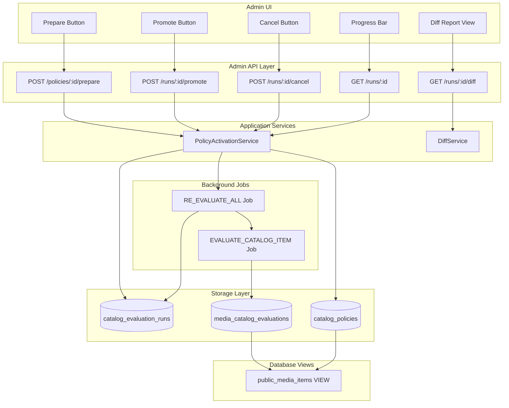
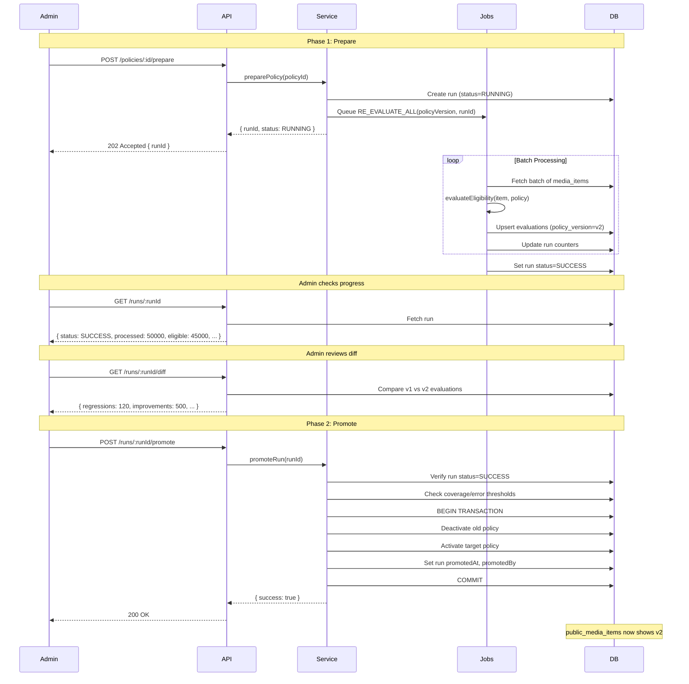
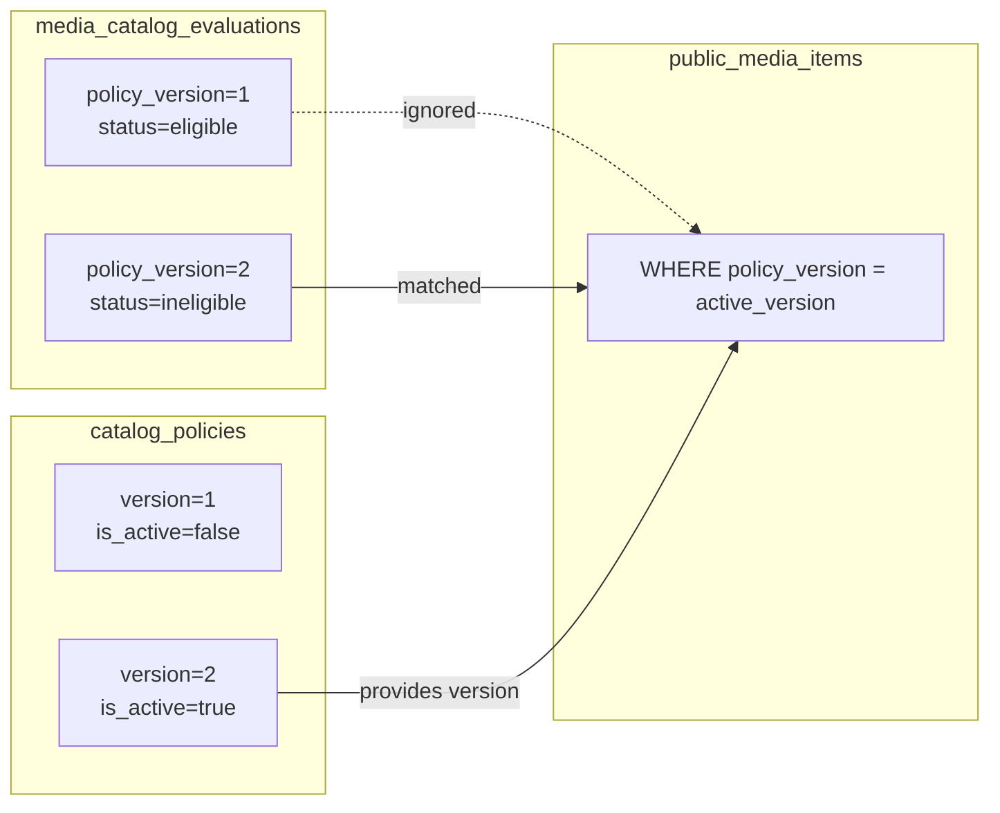
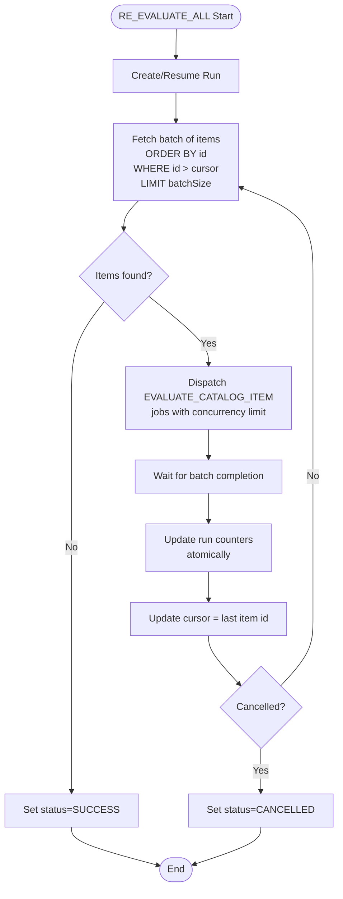

# Design Document: Policy Activation Flow

## Overview

Policy Activation Flow — production-grade система для безпечної активації catalog policies з двофазною архітектурою. Система забезпечує атомарне переключення між policy versions без ризику показати змішаний стан каталогу.

Ключові принципи:
- **Prepare → Promote**: Спочатку обчислюємо всі evaluations, потім миттєво переключаємо
- **Ідемпотентність**: Повторні запуски не створюють дублікатів
- **Observability**: Прогрес, статуси, diff-звіти для адмінки
- **Graceful degradation**: Rollback, resume, cancel

## Architecture



## Two-Phase Activation Flow



## Components and Interfaces

### 1. Extended Database Schema

#### catalog_evaluation_runs (розширення)
```typescript
interface CatalogEvaluationRun {
  id: UUID;
  targetPolicyId: UUID;           // FK to catalog_policies
  targetPolicyVersion: number;    // Denormalized for quick access
  status: RunStatus;              // RUNNING | SUCCESS | FAILED | CANCELLED | PROMOTED
  
  // Snapshot at run start (frozen, not recalculated)
  totalReadySnapshot: number;     // Items with ingestion_status='ready' at startedAt
  snapshotCutoff: Date;           // updated_at <= this timestamp for consistency
  
  // Counters
  processed: number;
  eligible: number;
  ineligible: number;
  pending: number;
  errors: number;
  
  // Error tracking
  errorSample: ErrorSample[];     // First 10 errors for diagnostics
  
  // Timestamps
  startedAt: Date;
  finishedAt: Date | null;
  promotedAt: Date | null;
  promotedBy: string | null;      // Admin user ID
  
  // Resumability
  cursor: string | null;
}

type RunStatus = 'RUNNING' | 'SUCCESS' | 'FAILED' | 'CANCELLED' | 'PROMOTED';

interface ErrorSample {
  mediaItemId: string;
  error: string;
  stack?: string;  // Truncated to 500 chars
  timestamp: Date;
}
```

### 2. PolicyActivationService

```typescript
// apps/api/src/modules/catalog-policy/application/services/policy-activation.service.ts

export interface PrepareOptions {
  batchSize?: number;      // default: 500
  concurrency?: number;    // default: 10
}

export interface PromoteOptions {
  coverageThreshold?: number;  // default: 0.95 (95%)
  maxErrors?: number;          // default: 0
}

export interface IPolicyActivationService {
  /**
   * Phase 1: Start evaluation of all items under target policy.
   * Creates run record and queues RE_EVALUATE_ALL job.
   * Does NOT change active policy.
   */
  preparePolicy(
    policyId: string,
    options?: PrepareOptions
  ): Promise<{ runId: string; status: RunStatus }>;

  /**
   * Phase 2: Activate policy after successful evaluation.
   * Verifies run status and thresholds, then atomically switches active policy.
   */
  promoteRun(
    runId: string,
    options?: PromoteOptions
  ): Promise<{ success: boolean; error?: string }>;

  /**
   * Cancel a running evaluation.
   * Signals workers to stop and preserves cursor for resume.
   */
  cancelRun(runId: string): Promise<void>;

  /**
   * Resume a failed run from cursor position.
   */
  resumeRun(runId: string): Promise<{ runId: string; status: RunStatus }>;

  /**
   * Get run status and progress.
   * Returns readyToPromote flag and blockingReasons if not ready.
   */
  getRunStatus(runId: string): Promise<CatalogEvaluationRun & { 
    readyToPromote: boolean;
    blockingReasons: BlockingReason[];
  }>;
}

export type BlockingReason = 
  | 'RUN_NOT_SUCCESS'
  | 'COVERAGE_NOT_MET'
  | 'ERRORS_EXCEEDED'
  | 'ALREADY_PROMOTED';

  /**
   * List all runs with optional filtering.
   */
  listRuns(options: {
    status?: RunStatus;
    policyId?: string;
    limit?: number;
    offset?: number;
  }): Promise<CatalogEvaluationRun[]>;
}
```

### 3. DiffService

```typescript
// apps/api/src/modules/catalog-policy/application/services/diff.service.ts

export interface DiffReport {
  runId: string;
  currentPolicyVersion: number;
  targetPolicyVersion: number;
  
  // Aggregated counts
  counts: {
    eligibleToIneligible: number;   // Regressions
    ineligibleToEligible: number;   // Improvements
    pendingToEligible: number;
    pendingToIneligible: number;
    eligibleToEligible: number;     // Unchanged eligible
    ineligibleToIneligible: number; // Unchanged ineligible
  };
  
  // Sampled items (top by trendingScore)
  samples: {
    regressions: DiffItem[];        // Max 50
    improvements: DiffItem[];       // Max 50
  };
  
  computedAt: Date;
}

export interface DiffItem {
  mediaItemId: string;
  title: string;
  type: 'movie' | 'show';
  trendingScore: number;
  oldStatus: EligibilityStatus;
  newStatus: EligibilityStatus;
  oldReasons: string[];
  newReasons: string[];
}

export interface IDiffService {
  /**
   * Compute diff between current active policy and target policy evaluations.
   * Uses aggregated SQL for counts, samples top items.
   */
  computeDiff(runId: string, sampleSize?: number): Promise<DiffReport>;
}
```

### 4. Job Handlers

```typescript
// RE_EVALUATE_ALL job
interface ReEvaluateAllPayload {
  runId: string;
  policyVersion: number;
  batchSize: number;
  concurrency: number;
  cursor?: string;  // For resume
}

// Job ID format: reeval:{policyVersion}:{runId}
// Ensures idempotency - same job won't be queued twice

// EVALUATE_CATALOG_ITEM job
interface EvaluateCatalogItemPayload {
  mediaItemId: string;
  policyVersion: number;
  runId: string;  // For progress tracking only
}

// Job ID format: eval:{policyVersion}:{mediaItemId}
// Uses policyVersion because evaluation is a function of (item, policy)
// runId is in payload for progress tracking, not deduplication
```

## Data Models

### Drizzle Schema Extension

```typescript
// apps/api/src/database/schema.ts

export const runStatusEnum = pgEnum('run_status', [
  'running',
  'success', 
  'failed',
  'cancelled',
  'promoted'
]);

// Extend catalog_evaluation_runs
export const catalogEvaluationRuns = pgTable('catalog_evaluation_runs', {
  id: uuid('id').defaultRandom().primaryKey(),
  targetPolicyId: uuid('target_policy_id')
    .references(() => catalogPolicies.id)
    .notNull(),
  targetPolicyVersion: integer('target_policy_version').notNull(),
  status: runStatusEnum('status').default('running').notNull(),
  
  // Counters
  totalReady: integer('total_ready').default(0).notNull(),
  processed: integer('processed').default(0).notNull(),
  eligible: integer('eligible').default(0).notNull(),
  ineligible: integer('ineligible').default(0).notNull(),
  pending: integer('pending').default(0).notNull(),
  errors: integer('errors').default(0).notNull(),
  
  // Error tracking
  errorSample: jsonb('error_sample').$type<ErrorSample[]>().default([]),
  
  // Timestamps
  startedAt: timestamp('started_at').defaultNow().notNull(),
  finishedAt: timestamp('finished_at'),
  promotedAt: timestamp('promoted_at'),
  promotedBy: text('promoted_by'),
  
  // Resumability
  cursor: text('cursor'),
}, (t) => ({
  targetPolicyIdx: index('catalog_eval_runs_target_policy_idx').on(t.targetPolicyId),
  statusIdx: index('catalog_eval_runs_status_idx').on(t.status),
  // Prevent multiple RUNNING runs for same policy
  runningPolicyUniq: uniqueIndex('catalog_eval_runs_running_policy_uniq')
    .on(t.targetPolicyId)
    .where(sql`status = 'running'`),
}));
```

### Updated public_media_items View

```sql
-- View now filters by active policy version
CREATE OR REPLACE VIEW public_media_items AS
SELECT 
  mi.id,
  mi.type,
  mi.tmdb_id,
  -- ... other fields ...
  mce.relevance_score,
  mce.status as eligibility_status
FROM media_items mi
LEFT JOIN media_stats ms ON ms.media_item_id = mi.id
INNER JOIN media_catalog_evaluations mce ON mce.media_item_id = mi.id
INNER JOIN catalog_policies cp ON cp.is_active = true
WHERE mce.status = 'eligible'
  AND mce.policy_version = cp.version  -- Filter by active policy version
  AND mi.ingestion_status = 'ready'
  AND mi.deleted_at IS NULL;
```

## Evaluation History Strategy



**Key Design Decision**: Evaluations are stored per policy_version, not overwritten. This enables:
- Instant rollback by changing active policy
- Diff computation between versions
- Audit trail of evaluation history

## Batch Processing Flow



## Idempotency Implementation

### Job Deduplication

```typescript
// Job queue configuration (e.g., BullMQ)
const reEvalJobOptions = {
  jobId: `reeval:${policyVersion}:${runId}`,
  removeOnComplete: true,
  removeOnFail: false,  // Keep for debugging
};

const evalItemJobOptions = {
  jobId: `eval:${policyVersion}:${mediaItemId}`,
  removeOnComplete: true,
  removeOnFail: 3,  // Retry 3 times
};
```

### Upsert Semantics

```typescript
// Evaluation upsert - handles retries gracefully
await db
  .insert(mediaCatalogEvaluations)
  .values({
    mediaItemId,
    status: evaluation.status,
    reasons: evaluation.reasons,
    relevanceScore,
    policyVersion,
    breakoutRuleId: evaluation.breakoutRuleId,
    evaluatedAt: new Date(),
  })
  .onConflictDoUpdate({
    target: [mediaCatalogEvaluations.mediaItemId, mediaCatalogEvaluations.policyVersion],
    set: {
      status: evaluation.status,
      reasons: evaluation.reasons,
      relevanceScore,
      breakoutRuleId: evaluation.breakoutRuleId,
      evaluatedAt: new Date(),
    },
  });
```

**Note**: This requires composite primary key or unique constraint on (media_item_id, policy_version).

## Diff Computation

### Aggregated SQL Query

```sql
-- Compute diff counts between v1 (active) and v2 (target)
WITH v1 AS (
  SELECT media_item_id, status, reasons
  FROM media_catalog_evaluations
  WHERE policy_version = :currentVersion
),
v2 AS (
  SELECT media_item_id, status, reasons
  FROM media_catalog_evaluations
  WHERE policy_version = :targetVersion
)
SELECT
  COUNT(*) FILTER (WHERE v1.status = 'eligible' AND v2.status = 'ineligible') as eligible_to_ineligible,
  COUNT(*) FILTER (WHERE v1.status = 'ineligible' AND v2.status = 'eligible') as ineligible_to_eligible,
  COUNT(*) FILTER (WHERE v1.status = 'pending' AND v2.status = 'eligible') as pending_to_eligible,
  COUNT(*) FILTER (WHERE v1.status = 'pending' AND v2.status = 'ineligible') as pending_to_ineligible,
  COUNT(*) FILTER (WHERE v1.status = 'eligible' AND v2.status = 'eligible') as eligible_unchanged,
  COUNT(*) FILTER (WHERE v1.status = 'ineligible' AND v2.status = 'ineligible') as ineligible_unchanged
FROM v1
FULL OUTER JOIN v2 ON v1.media_item_id = v2.media_item_id;
```

### Sampled Items Query

```sql
-- Get top regressions (eligible → ineligible) by trending score
SELECT 
  mi.id as media_item_id,
  mi.title,
  mi.type,
  mi.trending_score,
  v1.status as old_status,
  v2.status as new_status,
  v1.reasons as old_reasons,
  v2.reasons as new_reasons
FROM media_catalog_evaluations v1
JOIN media_catalog_evaluations v2 ON v1.media_item_id = v2.media_item_id
JOIN media_items mi ON mi.id = v1.media_item_id
WHERE v1.policy_version = :currentVersion
  AND v2.policy_version = :targetVersion
  AND v1.status = 'eligible'
  AND v2.status = 'ineligible'
ORDER BY mi.trending_score DESC NULLS LAST
LIMIT :sampleSize;
```

## Error Handling

### Run Failure Scenarios

| Scenario | Handling |
|----------|----------|
| Job worker crash | Run stays RUNNING, can be resumed from cursor |
| Database connection error | Retry with exponential backoff, update errorSample |
| Policy deleted during run | Fail run with clear error message |
| Timeout (configurable) | Set FAILED, preserve cursor |
| Manual cancel | Set CANCELLED, preserve cursor |

### Promote Failure Scenarios

| Scenario | Response |
|----------|----------|
| Run not SUCCESS | 400 Bad Request: "Run must be SUCCESS to promote" |
| Coverage below threshold | 400 Bad Request: "Coverage 87% below threshold 95%" |
| Errors above threshold | 400 Bad Request: "Errors 15 exceed max 0" |
| Policy already active | 400 Bad Request: "Policy already active" |
| Transaction failure | 500 Internal Error, rollback, run stays SUCCESS |

## API Endpoints

### POST /admin/catalog-policies/:id/prepare

```typescript
// Request
POST /admin/catalog-policies/123e4567-e89b-12d3-a456-426614174000/prepare
{
  "batchSize": 500,
  "concurrency": 10
}

// Response 202 Accepted
{
  "runId": "987fcdeb-51a2-3bc4-d567-890123456789",
  "status": "RUNNING",
  "targetPolicyVersion": 2
}
```

### GET /admin/catalog-policy-runs/:runId

```typescript
// Response 200 OK
{
  "id": "987fcdeb-51a2-3bc4-d567-890123456789",
  "targetPolicyId": "123e4567-e89b-12d3-a456-426614174000",
  "targetPolicyVersion": 2,
  "status": "SUCCESS",
  "totalReady": 50000,
  "processed": 50000,
  "eligible": 45000,
  "ineligible": 4500,
  "pending": 500,
  "errors": 0,
  "startedAt": "2024-01-15T10:00:00Z",
  "finishedAt": "2024-01-15T10:15:00Z",
  "readyToPromote": true,
  "coverage": 1.0,
  "errorRate": 0
}
```

### POST /admin/catalog-policy-runs/:runId/promote

```typescript
// Request
POST /admin/catalog-policy-runs/987fcdeb-51a2-3bc4-d567-890123456789/promote
{
  "coverageThreshold": 0.95,
  "maxErrors": 10
}

// Response 200 OK
{
  "success": true,
  "promotedAt": "2024-01-15T10:20:00Z",
  "previousPolicyVersion": 1,
  "newPolicyVersion": 2
}

// Response 400 Bad Request
{
  "success": false,
  "error": "Coverage 87% below threshold 95%"
}
```

### GET /admin/catalog-policy-runs/:runId/diff

```typescript
// Response 200 OK
{
  "runId": "987fcdeb-51a2-3bc4-d567-890123456789",
  "currentPolicyVersion": 1,
  "targetPolicyVersion": 2,
  "counts": {
    "eligibleToIneligible": 120,
    "ineligibleToEligible": 500,
    "pendingToEligible": 200,
    "pendingToIneligible": 50,
    "eligibleToEligible": 44380,
    "ineligibleToIneligible": 4250
  },
  "samples": {
    "regressions": [
      {
        "mediaItemId": "abc123",
        "title": "Some Movie",
        "type": "movie",
        "trendingScore": 85.5,
        "oldStatus": "eligible",
        "newStatus": "ineligible",
        "oldReasons": ["ALLOWED_COUNTRY"],
        "newReasons": ["BLOCKED_COUNTRY"]
      }
    ],
    "improvements": [...]
  },
  "computedAt": "2024-01-15T10:18:00Z"
}
```


## Correctness Properties

*A property is a characteristic or behavior that should hold true across all valid executions of a system—essentially, a formal statement about what the system should do. Properties serve as the bridge between human-readable specifications and machine-verifiable correctness guarantees.*


### Property 1: Run Initialization Correctness

*For any* policy and set of media items, when preparePolicy is called, the created run SHALL have status=RUNNING, totalReady equal to count of items with ingestion_status='ready' AND deleted_at IS NULL, and all counters initialized to 0.

**Validates: Requirements 1.2, 1.6**

### Property 2: Counter Consistency

*For any* batch of N items processed, the sum of (eligible + ineligible + pending + errors) after processing SHALL equal processed, and processed SHALL increase by exactly N.

**Validates: Requirements 1.3, 5.4**

### Property 3: State Transition - Completion

*For any* run that processes all items without errors, the final status SHALL be SUCCESS and finishedAt SHALL be set.

**Validates: Requirements 1.4, 2.5**

### Property 4: State Transition - Failure

*For any* run that encounters an unrecoverable error, the status SHALL be FAILED, cursor SHALL be preserved at last successful position, and errorSample SHALL contain error details.

**Validates: Requirements 1.5**

### Property 5: Evaluation Version Isolation

*For any* evaluation written during Prepare phase, the policy_version SHALL equal targetPolicyVersion, and evaluations with previous policy versions SHALL remain unchanged.

**Validates: Requirements 2.3, 10.1, 10.2**

### Property 6: Active Policy Immutability

*For any* Prepare or Cancel operation, the active policy (is_active=true) SHALL remain unchanged throughout the operation.

**Validates: Requirements 2.4, 8.5**

### Property 7: Promote Status Validation

*For any* promote request, if run status is not SUCCESS, the operation SHALL be rejected with 400 error. Promote SHALL only succeed for runs with status=SUCCESS.

**Validates: Requirements 3.1, 3.2, 3.8**

### Property 8: Promote Coverage Threshold

*For any* promote request with coverageThreshold T, if (processed / totalReady) < T, the operation SHALL be rejected.

**Validates: Requirements 3.3**

### Property 9: Promote Error Threshold

*For any* promote request with maxErrors M, if errors > M, the operation SHALL be rejected.

**Validates: Requirements 3.5**

### Property 10: Promote Atomicity

*For any* successful promote operation, either ALL of (deactivate old policy, activate new policy, set promotedAt) happen, or NONE happen. No partial state is possible.

**Validates: Requirements 3.6**

### Property 11: View Reflects Active Policy

*For any* query on public_media_items after promote, all returned rows SHALL have evaluations from the newly active policy version.

**Validates: Requirements 3.7, 10.4**

### Property 12: Ready To Promote Flag

*For any* run, readyToPromote SHALL be true if and only if: status=SUCCESS AND (processed/totalReady) >= coverageThreshold AND errors <= maxErrors.

**Validates: Requirements 3.9**

### Property 13: Idempotent Job Execution

*For any* job with the same jobId queued multiple times, the evaluation result SHALL be written exactly once (upsert semantics).

**Validates: Requirements 4.3, 4.6**

### Property 14: Resume From Cursor

*For any* failed run that is resumed, processing SHALL continue from the cursor position, not from the beginning.

**Validates: Requirements 4.4, 5.5**

### Property 15: Resume Policy Version Immutability

*For any* resume operation, the targetPolicyVersion SHALL equal the original run's targetPolicyVersion.

**Validates: Requirements 4.5**

### Property 16: State Machine Transitions

*For any* run:
- RUNNING → allows cancel, transitions to CANCELLED
- SUCCESS → allows promote, transitions to PROMOTED
- FAILED → allows resume, transitions to RUNNING
- PROMOTED → no operations allowed (terminal state)
- CANCELLED → no operations allowed (terminal state)

**Validates: Requirements 6.2, 6.3, 6.4, 6.5, 8.4**

### Property 17: Concurrent Run Prevention

*For any* policy with a RUNNING run, attempting to start another Prepare SHALL be rejected.

**Validates: Requirements 6.6**

### Property 18: Diff Counts Accuracy

*For any* diff report, the sum of all transition counts SHALL equal the total number of items evaluated in both versions.

**Validates: Requirements 7.2**

### Property 19: Diff Status Validation

*For any* diff request, if run status is not SUCCESS, the operation SHALL be rejected.

**Validates: Requirements 7.4**

### Property 20: Cancel State Preservation

*For any* cancel operation, the cursor and counters SHALL be preserved for potential resume.

**Validates: Requirements 8.1, 8.3**

### Property 21: Run Serialization Round-Trip

*For any* valid CatalogEvaluationRun object, serializing to JSON then deserializing SHALL produce an equivalent object with all fields preserved.

**Validates: Requirements 11.1**

### Property 22: Error Sample Preservation

*For any* error that occurs during evaluation, the errorSample SHALL contain mediaItemId, error message, and truncated stack trace.

**Validates: Requirements 11.3**

## Testing Strategy

### Unit Tests

1. **PolicyActivationService**
   - preparePolicy creates run with correct initial state
   - promoteRun validates status and thresholds
   - cancelRun sets correct status
   - resumeRun continues from cursor

2. **DiffService**
   - computeDiff returns correct counts
   - samples are sorted by trendingScore
   - handles empty results

3. **State Machine**
   - Valid transitions allowed
   - Invalid transitions rejected
   - Terminal states block all operations

### Property-Based Tests

Use fast-check library for property-based testing:

1. **Counter Consistency** (Property 2)
   - Generate random batches, verify counter math

2. **Evaluation Version Isolation** (Property 5)
   - Generate evaluations, verify version isolation

3. **Promote Thresholds** (Properties 8, 9)
   - Generate random coverage/error values, verify threshold logic

4. **State Machine** (Property 16)
   - Generate random state transition sequences, verify validity

5. **Serialization Round-Trip** (Property 21)
   - Generate random run objects, verify round-trip

### Integration Tests

1. **Full Prepare → Promote flow**
   - Create policy, prepare, verify progress, promote, verify view

2. **Failure and Resume**
   - Simulate failure, verify cursor preserved, resume, verify completion

3. **Cancel flow**
   - Start prepare, cancel, verify state preserved

4. **Diff computation**
   - Create two policy versions, verify diff accuracy

5. **Concurrent run prevention**
   - Attempt duplicate prepare, verify rejection

## Migrations

### Migration: Extend catalog_evaluation_runs

```sql
-- Add new columns to catalog_evaluation_runs
ALTER TABLE catalog_evaluation_runs
ADD COLUMN target_policy_id uuid REFERENCES catalog_policies(id),
ADD COLUMN target_policy_version integer,
ADD COLUMN total_ready integer DEFAULT 0,
ADD COLUMN eligible integer DEFAULT 0,
ADD COLUMN ineligible integer DEFAULT 0,
ADD COLUMN pending integer DEFAULT 0,
ADD COLUMN errors integer DEFAULT 0,
ADD COLUMN error_sample jsonb DEFAULT '[]',
ADD COLUMN promoted_at timestamp,
ADD COLUMN promoted_by text;

-- Rename status enum values
ALTER TYPE evaluation_run_status RENAME VALUE 'completed' TO 'success';
ALTER TYPE evaluation_run_status ADD VALUE 'cancelled';
ALTER TYPE evaluation_run_status ADD VALUE 'promoted';

-- Add unique constraint for running runs per policy
CREATE UNIQUE INDEX catalog_eval_runs_running_policy_uniq 
ON catalog_evaluation_runs (target_policy_id) 
WHERE status = 'running';

-- Add index for target policy
CREATE INDEX catalog_eval_runs_target_policy_idx 
ON catalog_evaluation_runs (target_policy_id);
```

### Migration: Update media_catalog_evaluations for multi-version

```sql
-- Change primary key to composite (media_item_id, policy_version)
-- This allows multiple evaluations per item (one per policy version)

-- First, drop existing primary key
ALTER TABLE media_catalog_evaluations DROP CONSTRAINT media_catalog_evaluations_pkey;

-- Add composite primary key
ALTER TABLE media_catalog_evaluations 
ADD PRIMARY KEY (media_item_id, policy_version);

-- Add index for querying by policy version
CREATE INDEX media_catalog_eval_policy_version_idx 
ON media_catalog_evaluations (policy_version);
```

### Migration: Update public_media_items view

```sql
-- Update view to filter by active policy version
CREATE OR REPLACE VIEW public_media_items AS
SELECT 
  mi.id,
  mi.type,
  mi.tmdb_id,
  mi.imdb_id,
  mi.title,
  mi.original_title,
  mi.slug,
  mi.overview,
  mi.poster_path,
  mi.backdrop_path,
  mi.videos,
  mi.credits,
  mi.watch_providers,
  mi.trending_score,
  mi.trending_rank,
  mi.popularity,
  mi.rating,
  mi.vote_count,
  mi.rating_imdb,
  mi.rating_metacritic,
  mi.rating_rotten_tomatoes,
  mi.rating_trakt,
  mi.release_date,
  mi.origin_countries,
  mi.original_language,
  mi.ingestion_status,
  mi.created_at,
  mi.updated_at,
  ms.ratingo_score,
  ms.quality_score,
  ms.popularity_score,
  ms.freshness_score,
  ms.watchers_count,
  mce.relevance_score,
  mce.status as eligibility_status
FROM media_items mi
LEFT JOIN media_stats ms ON ms.media_item_id = mi.id
INNER JOIN media_catalog_evaluations mce ON mce.media_item_id = mi.id
INNER JOIN catalog_policies cp ON cp.is_active = true AND mce.policy_version = cp.version
WHERE mce.status = 'eligible'
  AND mi.ingestion_status = 'ready'
  AND mi.deleted_at IS NULL;
```

## Design Decisions Log

### DD-1: Composite Primary Key for Evaluations

**Context**: How to store multiple evaluation versions per media item?

**Decision**: Change primary key from (media_item_id) to (media_item_id, policy_version).

**Rationale**:
- Allows multiple versions to coexist
- Enables instant rollback by changing active policy
- Supports diff computation between versions
- No data loss on policy changes

**Trade-off**: Slightly more complex queries, but worth it for safety and flexibility.

### DD-2: View Joins Active Policy

**Context**: How does public_media_items know which policy version to show?

**Decision**: View joins catalog_policies WHERE is_active=true and filters evaluations by that version.

**Rationale**:
- Single source of truth for active version
- Atomic switch when policy is promoted
- No need to update evaluations on promote

### DD-3: Coverage Threshold Default 100%

**Context**: What coverage threshold should be default?

**Decision**: 100% as default, with option to lower for specific cases.

**Rationale**:
- 100% ensures no "holes" in catalog after promote
- Items without evaluation for active version won't appear in view
- Lower thresholds (95%) only acceptable if business accepts temporary gaps
- Can be overridden per-promote call for staging/testing

**Important**: If coverage < 100%, items without v2 evaluation will disappear from public view until evaluated. This is intentional - no mixing of versions.

### DD-4: Unique Index for Running Runs

**Context**: How to prevent concurrent runs for same policy?

**Decision**: Partial unique index on (target_policy_id) WHERE status='running'.

**Rationale**:
- Database-level enforcement
- No race conditions
- Clear error message on violation

### DD-5: Error Sample Limit

**Context**: How many errors to store in errorSample?

**Decision**: First 10 errors with truncated stack traces (500 chars).

**Rationale**:
- Enough for diagnostics
- Doesn't bloat JSON column
- Stack traces truncated to prevent huge payloads

### DD-6: Active Policy Version Invariant

**Context**: How to ensure active policy is only changed through Promote?

**Decision**: Document and enforce invariant: `active_policy_version` changes ONLY through Promote Phase.

**Rationale**:
- Prevents manual UPDATE breaking the system
- Clear contract for the team
- Can be enforced via DB trigger if needed

**Implementation**: Add comment in code and consider DB trigger that rejects direct is_active updates outside of promote transaction.

### DD-7: Snapshot-Based Total Count

**Context**: How to handle items added/removed during long-running evaluation?

**Decision**: Freeze totalReadySnapshot and snapshotCutoff at run start. Only evaluate items with updated_at <= snapshotCutoff.

**Rationale**:
- Progress bar stays accurate (denominator doesn't change)
- New items added during run are not included (will be in next run)
- Deleted items don't cause "missing" evaluations
- Cursor-based pagination remains consistent

**Implementation**: 
- On run start: `snapshotCutoff = NOW()`, `totalReadySnapshot = COUNT(*) WHERE updated_at <= snapshotCutoff AND ingestion_status='ready' AND deleted_at IS NULL`
- Batch query: `WHERE updated_at <= snapshotCutoff AND id > cursor`

### DD-8: Job ID Uses policyVersion for Item Jobs

**Context**: How to ensure job idempotency for item evaluation?

**Decision**: Use `eval:{policyVersion}:{mediaItemId}` for item jobs.

**Rationale**:
- Evaluation is a pure function of (item, policyVersion)
- Natural deduplication: same item + same policy = same result
- runId is passed in payload for progress tracking only
- If run is restarted, already-evaluated items are skipped automatically
- Prevents duplicate work across retries/reruns
