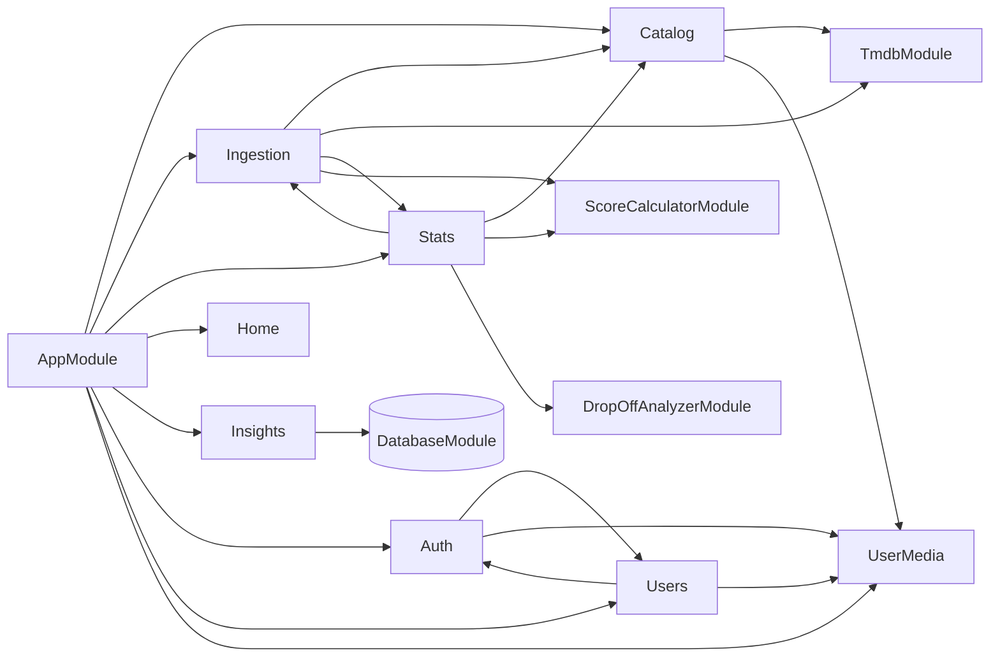
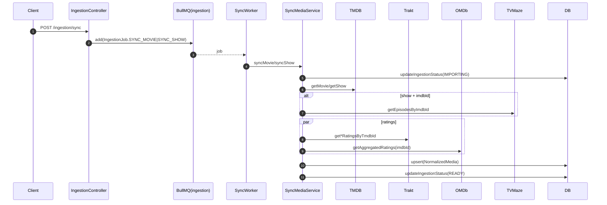
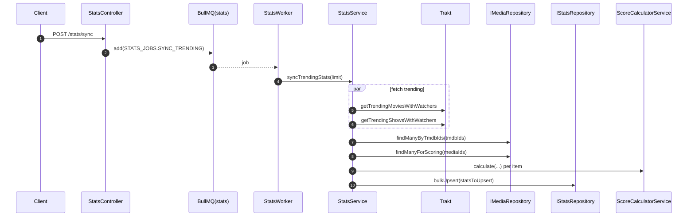
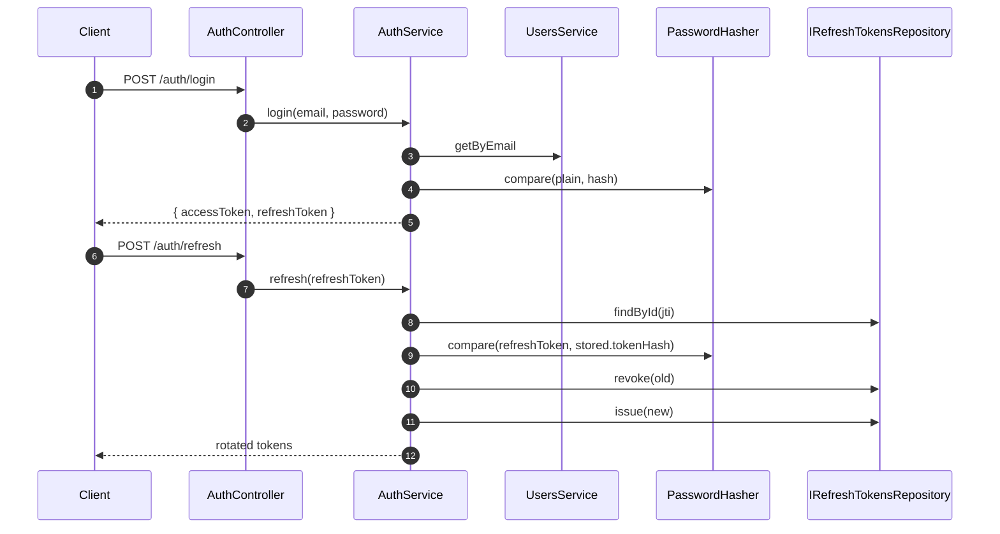

# Ratingo API — Architecture (apps/api/src)

## Scope

This document describes the runtime architecture of the NestJS API application located in `apps/api/src`.

## High-level overview

- **Framework**: NestJS with **Fastify** adapter
- **API prefix**: `/api` (global prefix)
- **Docs**: Swagger at `/docs`
- **Persistence**: PostgreSQL via **Drizzle ORM** (postgres-js driver)
- **Background jobs**: **BullMQ** (Redis)
- **External data providers**:
  - TMDB (metadata, assets, watch providers)
  - Trakt (ratings + watchers/stats + trending lists; also episode ratings for drop-off)
  - OMDb (IMDb/RT/Metacritic ratings)
  - TVMaze (episode schedule data for shows)
- **Core domain**: Catalog (movies/shows), Users & UserMedia state, Ingestion pipeline, Stats pipeline, Insights.

## Entry points & global concerns

### `main.ts`

- Bootstraps Nest application with `FastifyAdapter`.
- Global prefix: `api`.
- Global pipeline:
  - `ValidationPipe` with whitelist + transform.
  - `AllExceptionsFilter` for standardized error payload.
  - `ResponseInterceptor` wrapping successful responses as `{ success: true, data }`.
- Swagger configured via `SwaggerModule`.

### `app.module.ts`

Root module wiring:
- `ConfigModule.forRoot({ isGlobal: true })` loads:
  - `tmdb.config.ts`, `trakt.config.ts`, `omdb.config.ts`, `auth.config.ts`
  - Validates env via Joi.
- `BullModule.forRootAsync(...)` configures Redis connection.
- Imports feature modules:
  - `CatalogModule`, `IngestionModule`, `StatsModule`, `HomeModule`, `InsightsModule`, `AuthModule`, `UsersModule`, `UserMediaModule`

### Error handling & response shape

- **Errors**: `AllExceptionsFilter` converts thrown exceptions into `ApiErrorResponse`:
  - Custom `AppException` subclasses include `ErrorCode` + optional `details`.
  - `HttpException` is mapped to consistent `ErrorCode`.
  - In production, unknown errors are masked.
- **Success**: `ResponseInterceptor` converts `data` into `{ success: true, data }`.

### Configuration

- Centralized in `src/config/*`.
- Feature modules use `ConfigModule.forFeature(...)` to inject typed configs via `ConfigType<typeof config>`.

## Architectural layering

The codebase generally follows a 4-layer structure inside each module:

1. **presentation/**
   - REST controllers and DTOs.
   - Swagger decorators.
   - Guards and decorators for authentication context.

2. **application/**
   - Use-case orchestration.
   - Policy objects (e.g. privacy policy).
   - Services that coordinate repositories and adapters.

3. **domain/**
   - Interfaces/ports (repositories, service ports).
   - Entities and shared domain types.
   - No Nest/Drizzle dependencies.

4. **infrastructure/**
   - Drizzle repositories, query objects, persistence mappers.
   - HTTP adapters to external APIs.
   - Storage providers (e.g. S3).

DI is achieved via Nest providers and explicit **injection tokens** (symbols/strings) exported from `domain/**`.

## Modules map

## Persistence & database access

### `DatabaseModule`

- Provides a global Drizzle connection under token `DATABASE_CONNECTION`.
- Built using `postgres(connectionString)` and `drizzle(client, { schema })`.

### Schema

`src/database/schema.ts` contains Drizzle schema and reflects core aggregates:
- `media_items` (base catalog item; includes denormalized ratings/metrics and JSONB blocks)
- `media_stats` (fast-changing stats; updated frequently)
- `movies`, `shows` (type-specific tables)
- `seasons`, `episodes` (show structure)
- `genres`, `media_genres`
- `users`
- `user_media_state`
- `media_watchers_snapshots` (historical snapshots used by Insights)

### Repository pattern

- Domain defines interfaces like `IMediaRepository`, `IMovieRepository`, `IShowRepository`, `IUsersRepository`, etc.
- Modules bind tokens to Drizzle implementations.

### Query Objects

Catalog heavily uses **Query Objects** for complex reads:
- `TrendingMoviesQuery`, `TrendingShowsQuery`
- `MovieDetailsQuery`, `ShowDetailsQuery`
- `CalendarEpisodesQuery`
- `HeroMediaQuery`

Repositories act as thin facades delegating complex reads to these objects, while keeping writes and small reads locally.

## Background jobs (BullMQ)

### Queues

- **Ingestion**: `INGESTION_QUEUE = 'ingestion'`
  - Jobs: `IngestionJob` enum (sync movie/show, now playing, trending full, snapshots, etc.)
- **Stats**: `STATS_QUEUE = 'stats-queue'`
  - Jobs: `STATS_JOBS.SYNC_TRENDING`, `STATS_JOBS.ANALYZE_DROP_OFF`

### Workers

- `SyncWorker` (`@Processor(INGESTION_QUEUE, { concurrency: 5 })`)
  - Executes ingestion orchestration for different job types.
  - Calls `SyncMediaService` for movie/show sync.
  - Can trigger `StatsService.syncTrendingStats()` after a trending ingestion batch.
  - Calls `SnapshotsService.syncDailySnapshots()` for snapshots job.

- `StatsWorker` (`@Processor(STATS_QUEUE, { concurrency: 1 })`)
  - Handles batched stats sync and drop-off analysis jobs.

## External integrations

### TMDB

- `TmdbModule` exports `TmdbAdapter`.
- `TmdbAdapter` implements `IMetadataProvider` and maps responses into `NormalizedMedia` via `TmdbMapper`.
- Also provides:
  - `getTrending(page, type?)`
  - `getNowPlayingIds(region)`
  - `getNewReleaseIds(daysBack, region)`
  - `searchMulti(query, page)`

### Trakt

- `BaseTraktHttp` provides a typed `fetch<T>()` wrapper with 429 retry handling.
- `TraktListsAdapter`: trending lists with watchers + rank.
- `TraktRatingsAdapter`: ratings, watchers, stats, and structured episodes data for drop-off.

### OMDb

- `OmdbAdapter` fetches IMDb/RT/Metacritic ratings based on IMDb id.

### TVMaze

- `TvMazeAdapter` used primarily for **show episode schedule enrichment**.

### Object storage (S3/R2)

- Domain port: `IObjectStorageService` with token `OBJECT_STORAGE_SERVICE`.
- Implementation: `S3ObjectStorageService`.
- Used by `AvatarUploadService` to generate presigned upload URLs.

## Feature modules

### Catalog

**Purpose**: Public catalog browsing and details.

- **Controllers**:
  - `CatalogMoviesController`: trending, now-playing, new releases, new-on-digital, details by slug.
  - `CatalogShowsController`: trending, calendar, details by slug.
  - `CatalogSearchController`: search.

- **Application**:
  - `CatalogSearchService`:
    - Hybrid search: local DB (`IMediaRepository.search`) + TMDB (`TmdbAdapter.searchMulti`).
    - Local results take precedence and filter out duplicates by `tmdbId`.
  - `CatalogUserStateEnricher`:
    - Attaches `userState` to catalog results in batch using `UserMediaService.findMany`.

- **Domain tokens**:
  - `MEDIA_REPOSITORY`, `MOVIE_REPOSITORY`, `SHOW_REPOSITORY`, `GENRE_REPOSITORY`.

- **Infrastructure**:
  - Drizzle repositories: `DrizzleMediaRepository`, `DrizzleMovieRepository`, `DrizzleShowRepository`, `DrizzleGenreRepository`.
  - Query objects: trending/details/calendar/hero.
  - Mappers: `ImageMapper`, `CreditsMapper`, `WatchProvidersMapper`, `PersistenceMapper`.

### Ingestion

**Purpose**: Bring external metadata into local DB and keep it updated.

- **Controller**: `IngestionController`
  - Operational/admin endpoints that enqueue ingestion jobs and query job status.

- **Application**:
  - `SyncMediaService` orchestrates:
    - TMDB fetch (primary)
    - TVMaze enrichment for shows
    - Trakt + OMDb ratings
    - Score calculation via `ScoreCalculatorService`
    - Persistence via `IMediaRepository.upsert`
  - `SnapshotsService` persists daily watcher snapshots (`media_watchers_snapshots`).

- **Worker**: `SyncWorker` executes queued ingestion jobs.

- **Adapters**:
  - `TmdbAdapter`, `TraktRatingsAdapter`, `TraktListsAdapter`, `OmdbAdapter`, `TvMazeAdapter`

### Stats

**Purpose**: Real-time watchers, trending metrics, and drop-off analysis.

- **Controller**: `StatsController`
  - Enqueues stats sync and analysis jobs.
  - Exposes public stats read endpoints.

- **Application**:
  - `StatsService`:
    - Fetches trending lists from Trakt (movies & shows).
    - Maps to local media via `IMediaRepository.findManyByTmdbIds`.
    - Computes score components via `ScoreCalculatorService`.
    - Persists via `IStatsRepository.bulkUpsert`.
  - `DropOffService`:
    - Uses `TraktRatingsAdapter.getShowEpisodesForAnalysis`.
    - Runs `DropOffAnalyzerService.analyze()`.
    - Stores analysis JSON into shows table via `IShowRepository.saveDropOffAnalysis`.

- **Worker**: `StatsWorker` consumes queue jobs.

### Insights

**Purpose**: Trend/movement analytics based on watcher snapshots.

- **Controller**: `InsightsController` (public).
- **Application**: `InsightsService` maps window keys to days and delegates to repository.
- **Infrastructure**: `DrizzleInsightsRepository`:
  - Reads `media_watchers_snapshots` at multiple dates and calculates deltas.
  - Returns risers/fallers.

### Users

**Purpose**: User accounts and profile operations.

- **Controllers**:
  - `UsersController`: authenticated profile ops (me, update profile, change password, avatar upload URL).
  - `PublicUsersController`: public profile and lists (privacy-aware).

- **Application**:
  - `UsersService`: CRUD-ish access + public profile projection.
  - `PublicUserMediaService`: privacy-aware public lists (ratings/watchlist/history).
  - `AvatarUploadService`: presigned avatar upload URL.
  - `UserProfileVisibilityPolicy`: centralized privacy rules.

- **Infrastructure**:
  - `DrizzleUsersRepository`.
  - `S3ObjectStorageService`.

### UserMedia

**Purpose**: Track per-user media state (planned/watching/completed/etc.), ratings, notes, progress.

- **Controllers**:
  - `UserMediaController`: upsert and read state.
  - `MeListsController`: owner-only lists (ratings/watchlist/history/activity).

- **Application**:
  - `UserMediaService`: API-facing use cases.
  - `MeListsService`: list slices + total counts.

- **Infrastructure**:
  - `DrizzleUserMediaStateRepository`.

### Auth

**Purpose**: Authentication, JWT issuing/verification, refresh token rotation.

- **Controller**: `AuthController`.
- **Application**: `AuthService`.
- **Domain ports**:
  - `PASSWORD_HASHER` (`PasswordHasher`) → implemented by `BcryptPasswordHasher`.
  - `REFRESH_TOKENS_REPOSITORY` (`IRefreshTokensRepository`) → implemented by `DrizzleRefreshTokensRepository`.
- **Strategies/guards**:
  - `JwtStrategy` / `JwtAuthGuard`
  - `LocalStrategy` / `LocalAuthGuard`
  - `OptionalJwtAuthGuard` (anonymous-friendly)

### Home

**Purpose**: Homepage aggregates (hero block).

- `HomeController` → `HomeService` → `IMediaRepository.findHero(limit, type?)`.

## Main runtime flows

### 1) Manual ingestion sync (single item)

### 2) Trending full sync (batch)

- Triggered by `POST /ingestion/trending`.
- Worker flow:
  1. TMDB trending list
  2. sequential sync per item (rate-limit friendly)
  3. optionally triggers stats sync

### 3) Stats sync (Trakt trending → DB)

### 4) Auth (login/refresh)

## Conventions & invariants

- **API responses**:
  - success: `{ success: true, data }`
  - error: `{ success: false, error: { code, message, statusCode, details? } }`
- **Controllers**: pure orchestration; delegate heavy logic to application services/repositories.
- **Domain**: interfaces + tokens, no Drizzle/Nest specifics.
- **Infra**: Drizzle + external HTTP; throws `DatabaseException`/`ExternalApiException` where appropriate.
- **User context**:
  - `JwtStrategy.validate()` maps JWT payload into `{ id, email, role }`.
  - `CurrentUser` decorator reads `request.user`.
- **Privacy**:
  - `UserProfileVisibilityPolicy` is the single source of truth for public profile/list exposure.

## How to extend

### Add a new feature module

1. Create module folder: `src/modules/<name>/` with subfolders:
   - `presentation/`, `application/`, `domain/`, `infrastructure/`
2. Define domain ports:
   - `domain/repositories/*.interface.ts` and export tokens.
3. Implement infra:
   - `infrastructure/repositories/*` and bind token→class in `<name>.module.ts`.
4. Add `<Name>Module` import to `AppModule`.

### Add a new background job

1. Add job name to `*.constants.ts`.
2. Register queue (if new) via `BullModule.registerQueue({ name })`.
3. Add producer call (controller/service) using `@InjectQueue(name)`.
4. Add worker handler in `WorkerHost.process(job)`.

### Add a new external provider

1. Add config in `src/config/*.config.ts`.
2. Create adapter in `infrastructure/adapters/` with typed wrapper + error mapping.
3. Inject in orchestration service (e.g. `SyncMediaService`).

---

Generated from the current codebase in `apps/api/src`.
